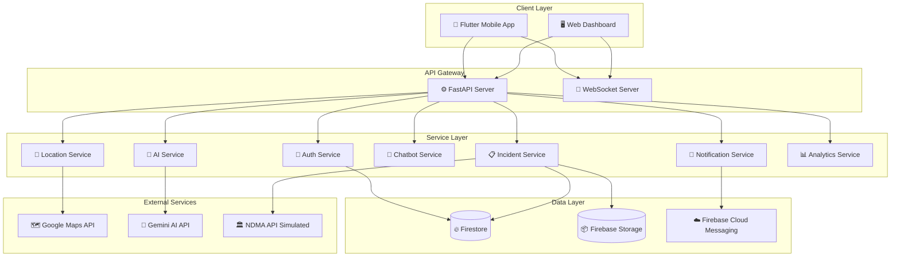
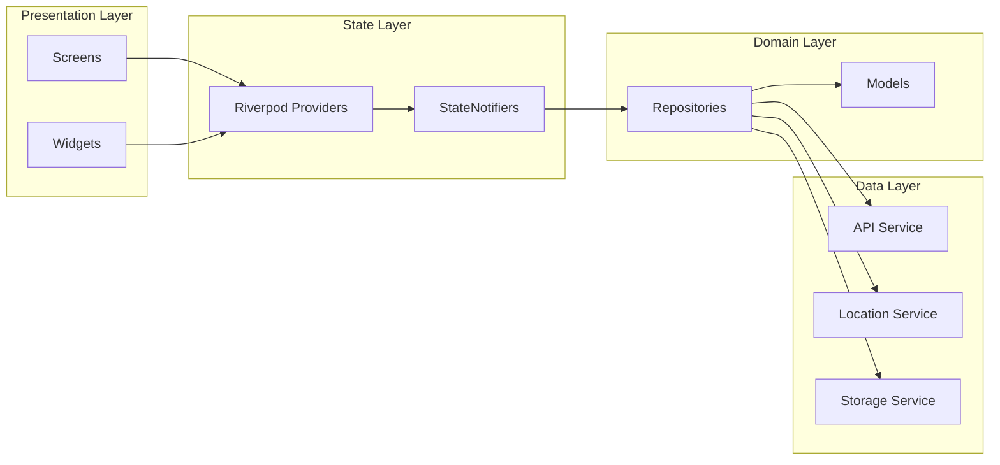
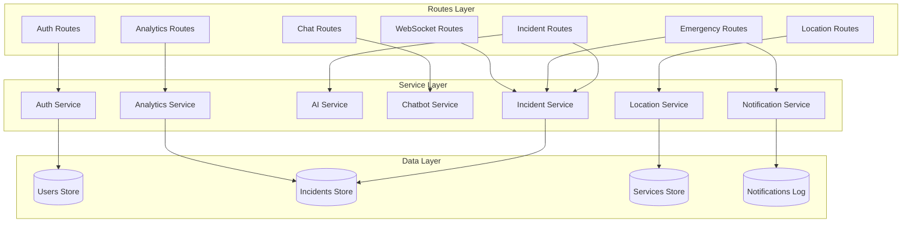
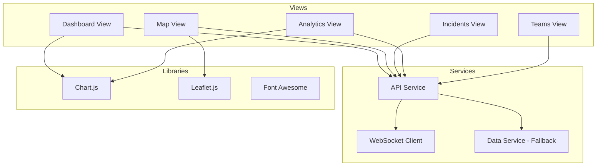
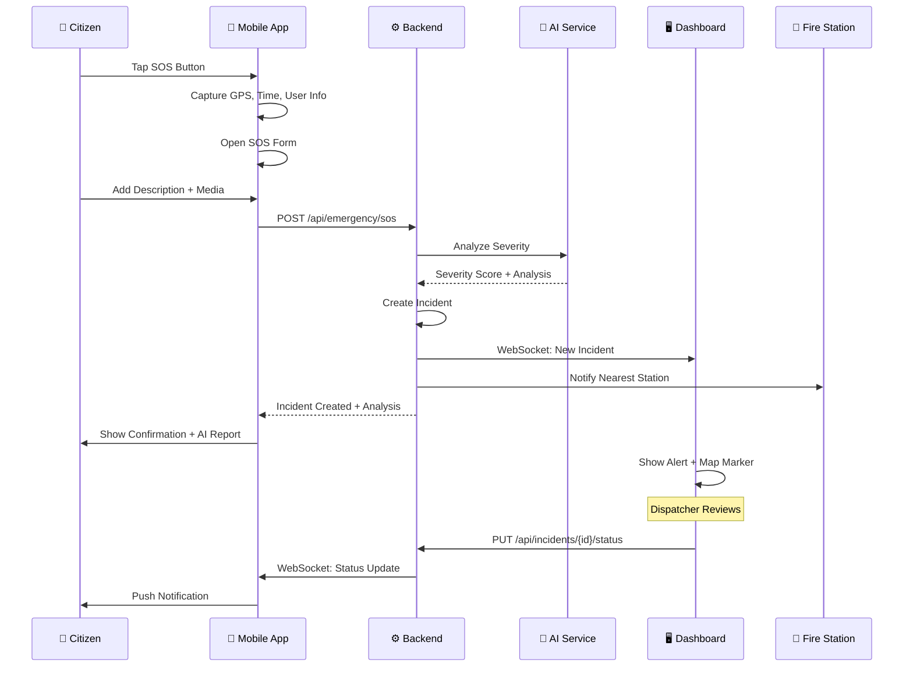
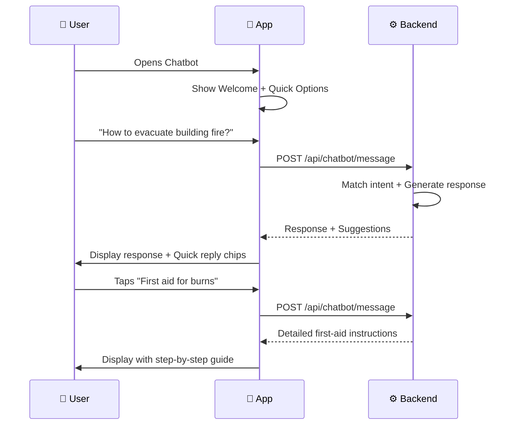
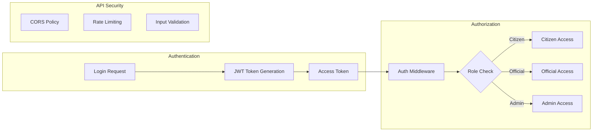
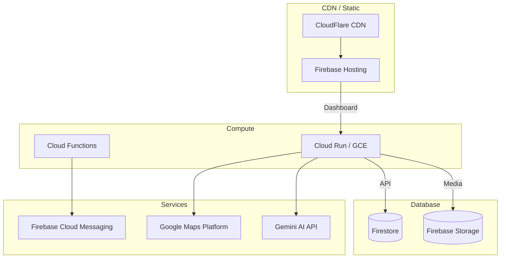

# FireShield AI — System Architecture

## High-Level Architecture

## Component Details

### 1. Flutter Mobile App

**Features by Module:**

| Module | Screens | Key Functionality |
|--------|---------|-------------------|
| Auth | Splash, Onboarding, Login, Register | JWT auth, demo login |
| Home | Home Dashboard | SOS button, quick actions, emergency numbers |
| SOS | SOS Report | GPS capture, media upload, AI analysis |
| Chatbot | Chat Interface | Emergency guidance, multi-language |
| Map | Nearby Services | Google Maps integration, service locator |
| Incidents | List, Detail | History, timeline, status tracking |
| Profile | User Profile | Stats, emergency contacts |
| Settings | App Settings | Theme, language, notifications |

### 2. FastAPI Backend

### 3. Web Dashboard

## Data Flow Diagrams

### SOS Emergency Flow

### Chatbot Flow

## Security Architecture

## Deployment Architecture (Production)

## Scalability Considerations

| Aspect | Strategy |
|--------|----------|
| **Horizontal Scaling** | Stateless API design, can deploy multiple instances behind load balancer |
| **Database** | Firestore auto-scales, composite indexes for complex queries |
| **Media Storage** | Firebase Storage with CDN for fast media delivery |
| **Real-time** | WebSocket with connection pooling, fallback to polling |
| **Caching** | Redis layer for frequently accessed data (fire stations, analytics) |
| **AI Processing** | Async queue for AI analysis, batch processing for non-urgent analysis |
| **Geospatial** | GeoHash indexing for efficient proximity queries |
| **Monitoring** | Cloud Monitoring, error tracking, performance metrics |

## Technology Decision Rationale

| Decision | Rationale |
|----------|-----------|
| Flutter over React Native | Better performance, single codebase, Material 3 native support |
| FastAPI over Django/Express | Async support, auto-generated docs, Python ML ecosystem |
| Riverpod over BLoC | Less boilerplate, better testability, compile-time safety |
| Leaflet over Google Maps (Dashboard) | Free, no API key, OSM tiles, better for web dashboards |
| In-memory over Firebase (MVP) | Zero setup for hackathon demo, easy to swap for production |
| JWT over Session | Stateless, mobile-friendly, scalable |
| WebSocket over SSE | Bidirectional, lower latency, better for real-time dispatch |
