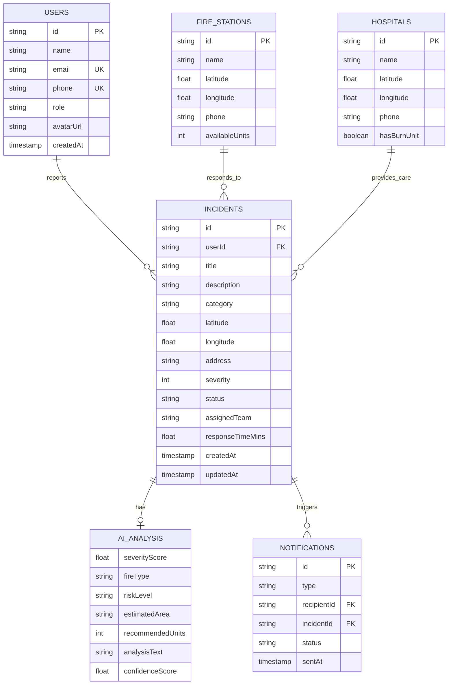

# FireShield AI — Firebase Schema & Database Design

## Overview

This document describes the complete database schema for FireShield AI. The MVP uses in-memory storage for demo purposes, but the schema is designed for direct migration to Firebase Firestore.

## Firestore Collections

### 1. `users` Collection

Stores all registered user profiles.

```json
{
  "id": "uuid-string",
  "name": "Rahul Sharma",
  "email": "rahul@example.com",
  "phone": "+91-9876543210",
  "avatarUrl": "https://storage.firebase.com/avatars/user123.jpg",
  "role": "citizen",
  "language": "en",
  "createdAt": "2025-01-15T10:30:00Z",
  "updatedAt": "2025-06-20T14:22:00Z",
  "fcmToken": "firebase-cloud-messaging-token",
  "emergencyContacts": [
    {
      "name": "Priya Sharma",
      "phone": "+91-9876543211",
      "relationship": "spouse"
    },
    {
      "name": "Amit Kumar",
      "phone": "+91-9876543212",
      "relationship": "neighbor"
    }
  ],
  "address": {
    "line1": "42, MG Road",
    "city": "Bangalore",
    "state": "Karnataka",
    "pincode": "560001"
  },
  "settings": {
    "notificationsEnabled": true,
    "locationSharing": true,
    "darkMode": true,
    "language": "en"
  }
}
```

**Indexes:**
- `email` (unique)
- `phone` (unique)
- `role` (for filtering officials/admins)

**Security Rules:**
```javascript
match /users/{userId} {
  allow read: if request.auth != null && request.auth.uid == userId;
  allow write: if request.auth != null && request.auth.uid == userId;
  allow read: if get(/databases/$(database)/documents/users/$(request.auth.uid)).data.role in ['official', 'admin'];
}
```

---

### 2. `incidents` Collection

Core collection storing all fire incident reports.

```json
{
  "id": "uuid-string",
  "userId": "user-uuid-ref",
  "userName": "Rahul Sharma",
  "userPhone": "+91-9876543210",
  "title": "Building Fire at MG Road Commercial Complex",
  "description": "Large fire spotted on the 3rd floor of the commercial complex. Smoke visible from outside. Multiple people trapped inside.",
  "category": "building",
  "location": {
    "latitude": 12.9716,
    "longitude": 77.5946,
    "address": "MG Road Commercial Complex, MG Road, Bangalore, Karnataka 560001",
    "city": "Bangalore",
    "state": "Karnataka",
    "geohash": "tdr1y3"
  },
  "severity": 4,
  "status": "assigned",
  "mediaUrls": [
    "https://storage.firebase.com/incidents/inc123/photo1.jpg",
    "https://storage.firebase.com/incidents/inc123/video1.mp4"
  ],
  "aiAnalysis": {
    "severityScore": 4.2,
    "fireType": "Commercial Building Fire",
    "riskLevel": "HIGH",
    "estimatedAffectedArea": "500 sq meters",
    "recommendedUnits": 4,
    "analysisText": "High-severity commercial building fire detected. Multiple floors potentially affected. Immediate multi-unit response recommended. Potential structural risk due to building age. Evacuation priority: HIGH.",
    "confidenceScore": 0.87,
    "analyzedAt": "2025-06-20T14:25:00Z"
  },
  "assignedTeam": "Alpha Team",
  "assignedStation": "Bangalore Central Fire Station",
  "responseTimeMins": 8.5,
  "statusHistory": [
    {
      "status": "reported",
      "timestamp": "2025-06-20T14:22:00Z",
      "updatedBy": "system"
    },
    {
      "status": "acknowledged",
      "timestamp": "2025-06-20T14:23:30Z",
      "updatedBy": "official@demo.com"
    },
    {
      "status": "assigned",
      "timestamp": "2025-06-20T14:25:00Z",
      "updatedBy": "official@demo.com",
      "notes": "Alpha Team dispatched with 2 fire engines"
    }
  ],
  "notes": [
    {
      "text": "Confirmed 3rd floor fire, 2 engines dispatched",
      "author": "Station Commander",
      "timestamp": "2025-06-20T14:25:30Z"
    }
  ],
  "createdAt": "2025-06-20T14:22:00Z",
  "updatedAt": "2025-06-20T14:25:00Z",
  "resolvedAt": null
}
```

**Indexes:**
- `status` + `createdAt` (compound, descending)
- `severity` + `createdAt` (compound)
- `userId` + `createdAt` (compound)
- `location.city` + `createdAt` (compound)
- `location.geohash` (for geospatial queries)
- `assignedTeam` + `status` (compound)

**Security Rules:**
```javascript
match /incidents/{incidentId} {
  // Citizens can create and read their own incidents
  allow create: if request.auth != null;
  allow read: if request.auth != null && (
    resource.data.userId == request.auth.uid ||
    get(/databases/$(database)/documents/users/$(request.auth.uid)).data.role in ['official', 'admin']
  );
  // Only officials/admins can update
  allow update: if request.auth != null &&
    get(/databases/$(database)/documents/users/$(request.auth.uid)).data.role in ['official', 'admin'];
}
```

---

### 3. `fire_stations` Collection

Reference data for fire stations across India.

```json
{
  "id": "station-uuid",
  "name": "Bangalore Central Fire Station",
  "location": {
    "latitude": 12.9784,
    "longitude": 77.5719,
    "address": "Corporation Circle, Bangalore, Karnataka 560001",
    "geohash": "tdr1y2"
  },
  "phone": "+91-80-22212121",
  "email": "central@bangalorefire.gov.in",
  "district": "Bangalore Urban",
  "state": "Karnataka",
  "type": "headquarters",
  "availableUnits": 5,
  "totalUnits": 8,
  "teams": [
    {
      "name": "Alpha Team",
      "status": "available",
      "members": 6,
      "vehicleType": "fire_engine"
    },
    {
      "name": "Bravo Team",
      "status": "on_scene",
      "members": 6,
      "vehicleType": "ladder_truck",
      "currentIncident": "incident-uuid"
    }
  ],
  "equipment": ["fire_engine", "ladder_truck", "rescue_van", "water_tanker"],
  "operatingHours": "24/7",
  "isActive": true
}
```

**Indexes:**
- `location.geohash` (for proximity search)
- `state` + `district` (compound)
- `isActive`

---

### 4. `hospitals` Collection

Reference data for nearby hospitals.

```json
{
  "id": "hospital-uuid",
  "name": "Victoria Hospital",
  "location": {
    "latitude": 12.9585,
    "longitude": 77.5730,
    "address": "Fort Road, Bangalore, Karnataka 560002",
    "geohash": "tdr1xz"
  },
  "phone": "+91-80-26701150",
  "emergencyPhone": "+91-80-26701151",
  "type": "government",
  "hasBurnUnit": true,
  "hasEmergency": true,
  "bedCapacity": 1500,
  "isActive": true
}
```

---

### 5. `police_stations` Collection

Reference data for police stations.

```json
{
  "id": "police-uuid",
  "name": "MG Road Police Station",
  "location": {
    "latitude": 12.9758,
    "longitude": 77.6033,
    "address": "MG Road, Bangalore, Karnataka 560001",
    "geohash": "tdr1y4"
  },
  "phone": "+91-80-22942342",
  "emergencyPhone": "100",
  "district": "Bangalore Urban",
  "isActive": true
}
```

---

### 6. `notifications` Collection

Log of all sent notifications.

```json
{
  "id": "notification-uuid",
  "type": "sos_alert",
  "title": "🚨 SOS: Building Fire Reported",
  "body": "Fire reported at MG Road Commercial Complex, Bangalore. Severity: 4/5.",
  "recipientType": "fire_station",
  "recipientId": "station-uuid",
  "incidentId": "incident-uuid",
  "channel": "fcm",
  "status": "sent",
  "sentAt": "2025-06-20T14:22:05Z",
  "readAt": null
}
```

---

### 7. `analytics` Collection

Pre-computed analytics data.

```json
{
  "id": "2025-06-20",
  "type": "daily",
  "date": "2025-06-20",
  "metrics": {
    "totalIncidents": 12,
    "newIncidents": 5,
    "resolvedIncidents": 8,
    "activeIncidents": 4,
    "avgResponseTimeMins": 7.3,
    "incidentsBySeverity": {
      "1": 2,
      "2": 3,
      "3": 4,
      "4": 2,
      "5": 1
    },
    "incidentsByStatus": {
      "reported": 1,
      "acknowledged": 1,
      "assigned": 1,
      "en_route": 1,
      "arrived": 0,
      "resolved": 8
    },
    "incidentsByCategory": {
      "building": 4,
      "industrial": 2,
      "kitchen": 3,
      "electrical": 2,
      "vehicle": 1
    },
    "topCities": [
      {"city": "Delhi", "count": 4},
      {"city": "Mumbai", "count": 3},
      {"city": "Bangalore", "count": 3}
    ]
  }
}
```

---

## Entity Relationship Diagram



## Migration Strategy (In-Memory → Firebase)

| Step | Action |
|------|--------|
| 1 | Create Firebase project and enable Firestore |
| 2 | Replace in-memory dicts with Firestore client (firebase-admin SDK) |
| 3 | Add Firebase Auth integration replacing JWT |
| 4 | Configure Firebase Storage for media uploads |
| 5 | Set up Cloud Firestore security rules |
| 6 | Add composite indexes for query patterns |
| 7 | Enable Firebase Cloud Messaging for push notifications |
| 8 | Set up Cloud Functions for server-side triggers |
| 9 | Configure Firebase Hosting for the dashboard |
